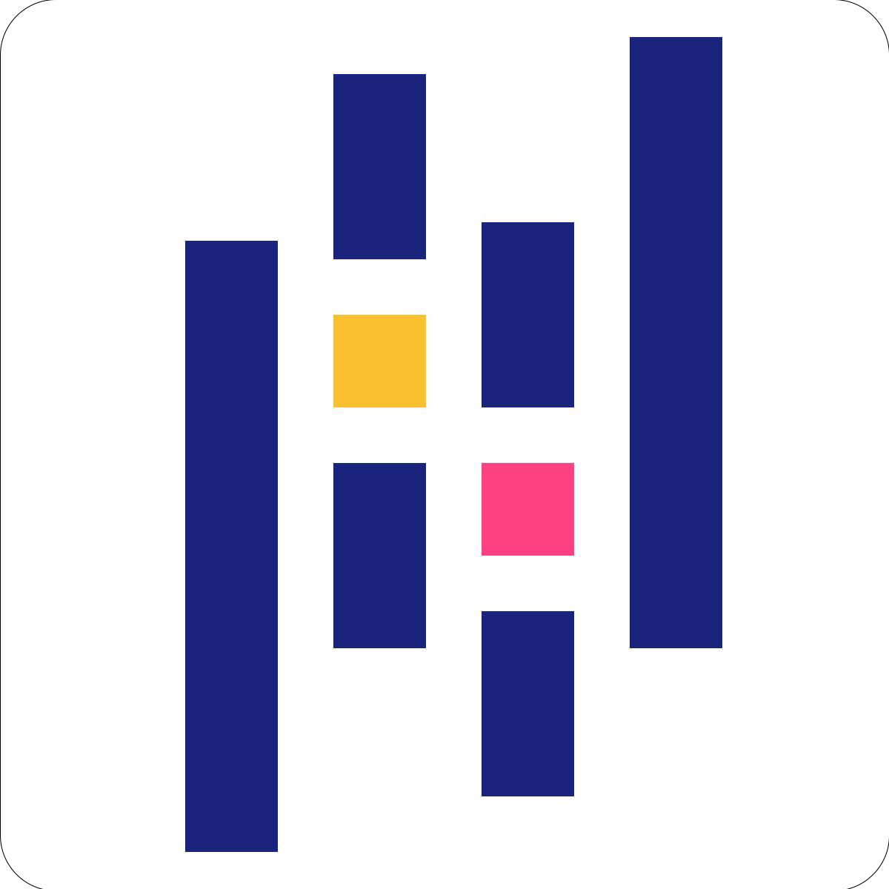
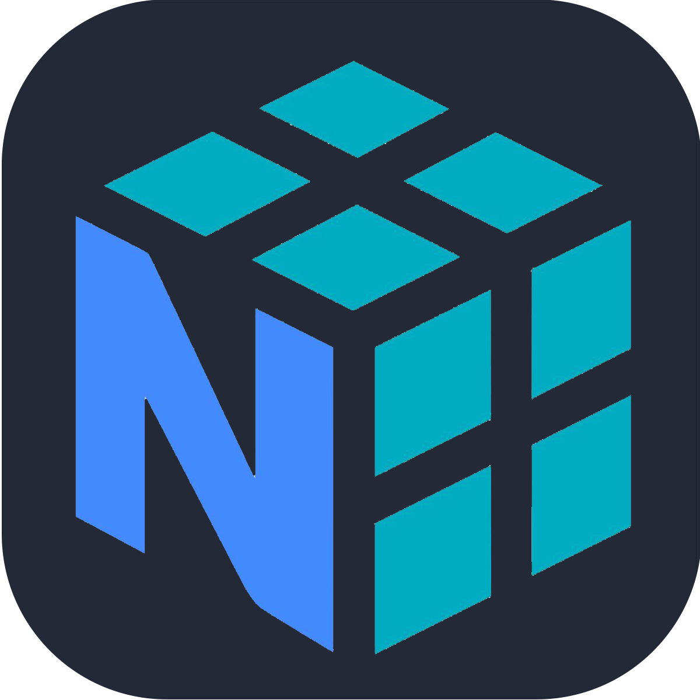
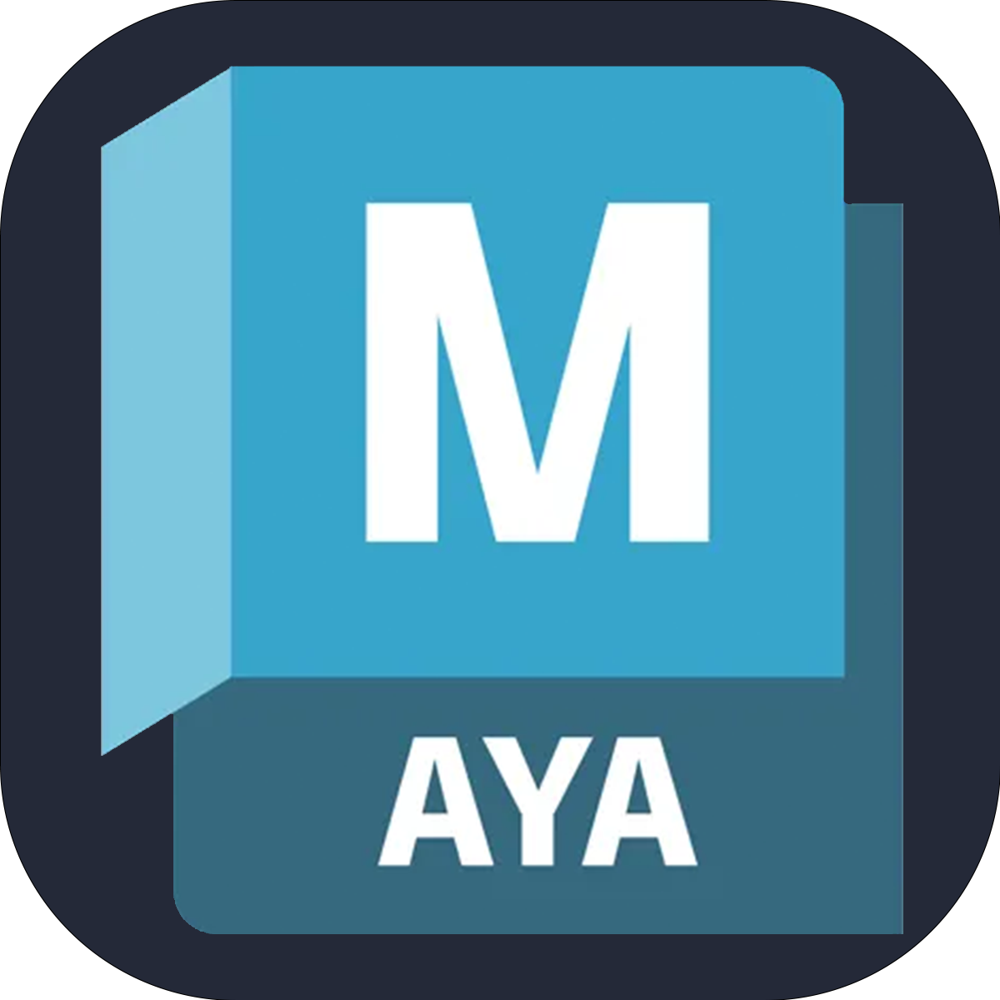

### Hi there, I'm Imai Yuki 👋
大学で情報系を専攻している学生です。
主に **LLM（大規模言語モデル）のアプリケーション応用** や **バックエンド開発** に興味がありますが、実務経験はないです！
「技術を使って、身近な課題を解決すること」を大切にしています。
 

| Attribute | Detail |
| :--- | :--- |
| **🎂 Age** | 22歳 (2003年生まれ) |
| **🏫 University** | 千葉工業大学 先進工学部 知能メディア工学科 |
| **❤️ Likes** | ゲーム(LoL,OW),サイクリング,サウナ,海(泳げないけど) |

---

### 🛠 Skills & Proficiency

#### 💻 Development & Data Science

| Tech | Proficiency | Note &nbsp;&nbsp;&nbsp;&nbsp;&nbsp;&nbsp;&nbsp;&nbsp;&nbsp;&nbsp;&nbsp;&nbsp;&nbsp;&nbsp;&nbsp;&nbsp;&nbsp;&nbsp;&nbsp;&nbsp;&nbsp;&nbsp;&nbsp;&nbsp;&nbsp;&nbsp;&nbsp;&nbsp;&nbsp;&nbsp;&nbsp;&nbsp;&nbsp;&nbsp;&nbsp;&nbsp;&nbsp;&nbsp;&nbsp;&nbsp;&nbsp;&nbsp;&nbsp;&nbsp;&nbsp;&nbsp;&nbsp;&nbsp;&nbsp;&nbsp;&nbsp;&nbsp;&nbsp;&nbsp;&nbsp;&nbsp;&nbsp;&nbsp;&nbsp;&nbsp;&nbsp;&nbsp;&nbsp;&nbsp;&nbsp;&nbsp;&nbsp;&nbsp;&nbsp;&nbsp;&nbsp;&nbsp;&nbsp;&nbsp;&nbsp;&nbsp;&nbsp;&nbsp;&nbsp;&nbsp;&nbsp;&nbsp;&nbsp;&nbsp;&nbsp;&nbsp;&nbsp;&nbsp; |
| :---: | :---: | :--- |
|  | ★★★★☆ | メイン言語。複雑すぎなければ自分でもコードを書けます。 |
|  | ★☆☆☆☆ | 勉強中です。AIに今のところ任せながら作っています |
|  | ★★☆☆☆ | 基本的なコーディングと解読はできます。AIに原型を作ってもらって微調整しています。 |
|  | ★★☆☆☆ | HTMLと同じぐらいです。 |
|  | ★★☆☆☆ | 基本的なテーブルやビュー、データベースやユーザーの作成やデータの抽出はできます。 |
|  | ★☆☆☆☆ | 授業で軽く触ったぐらいです。勉強中です。 |
|  | ★★★☆☆ | モデルの利用・ファインチューニングする時に使っています。 |
|  | ★★☆☆☆ | 主にtransformers使ってLLMチューニングする時に使ってます。 |
|  | ★★☆☆☆ | Pytorchと同じく主にtransformers使ってLLMチューニングする時に使ってます。 |
|  | ★★☆☆☆ | データの整形とかに使ってます。 |
|  | ★★☆☆☆ | Pandasと同じくデータの整形とかで使用します。 |
|  | ★☆☆☆☆ | 授業で触ったぐらいです。 |
|  | ★★☆☆☆ | 簡単なゲームぐらいなら作ってスマホ等にデプロイするところまでできます。 |

#### 🎨 Creative & Design

| Tool | Proficiency | Note &nbsp;&nbsp;&nbsp;&nbsp;&nbsp;&nbsp;&nbsp;&nbsp;&nbsp;&nbsp;&nbsp;&nbsp;&nbsp;&nbsp;&nbsp;&nbsp;&nbsp;&nbsp;&nbsp;&nbsp;&nbsp;&nbsp;&nbsp;&nbsp;&nbsp;&nbsp;&nbsp;&nbsp;&nbsp;&nbsp;&nbsp;&nbsp;&nbsp;&nbsp;&nbsp;&nbsp;&nbsp;&nbsp;&nbsp;&nbsp;&nbsp;&nbsp;&nbsp;&nbsp;&nbsp;&nbsp;&nbsp;&nbsp;&nbsp;&nbsp;&nbsp;&nbsp;&nbsp;&nbsp;&nbsp;&nbsp;&nbsp;&nbsp;&nbsp;&nbsp;&nbsp;&nbsp;&nbsp;&nbsp;&nbsp;&nbsp;&nbsp;&nbsp;&nbsp;&nbsp;&nbsp;&nbsp;&nbsp;&nbsp;&nbsp;&nbsp;&nbsp;&nbsp;&nbsp;&nbsp;&nbsp;&nbsp;&nbsp;&nbsp;&nbsp;&nbsp;&nbsp;&nbsp; |
| :---: | :---: | :--- |
|  | ★★★☆☆ | オートレイアウトやコンポーネントの作成ぐらいまでならできます。 |
|  | ★★☆☆☆ | 簡単な画像加工ぐらいならできます。 |
|  | ★★☆☆☆ | 基本的な作成はできますが、最近はFigmaばかり使っています。 |
|  | ★★☆☆☆ | 素材があるのであれば動画を作ることができます。 |
|  | ★☆☆☆☆ | 授業で触ったことがあるぐらいです。 |
|  | ★☆☆☆☆ | 授業で触ったことがあるぐらいです。 |
|  | ★★★☆☆ | YoutubeやTwitchで配信するぐらいまでならできます。 |
### 🚀 Featured Project

#### [TermsChecker - 利用規約「危険条項」自動検知アプリ](https://github.com/Im-YuRam/TermsChecker)
利用規約のURLを入力するだけで、Gemini APIが「ユーザーにとって不利な条項」や「注意点」を自動で要約・警告するWebアプリケーションです。

* **課題解決:** 難解で長文な利用規約を、一般ユーザーでも一瞬で理解できるように可視化。
* **技術的な工夫:** 当初予定していたローカルLLM（Swallow-7b）の推論速度の課題に直面し、UXを優先して高速なGemini 1.5 Flashモデルへピボットしました。APIキーのセキュアな管理や、デモモードの実装なども行っています。
* **担当:** バックエンド開発リード、AIモデル実装

---

